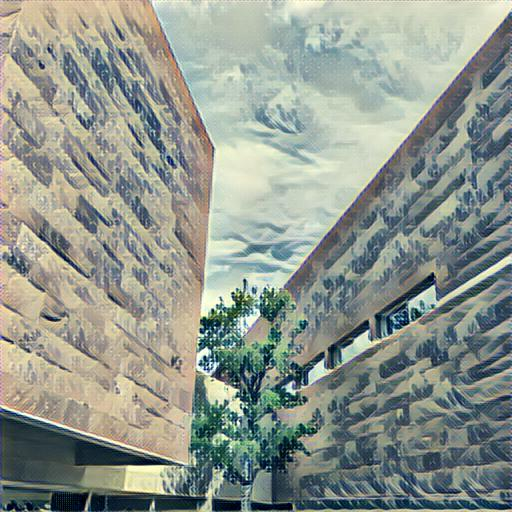
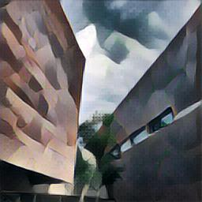
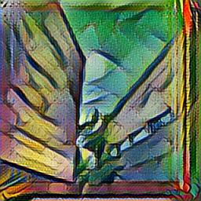

# Style Transfer #

A tensorflow implementation for two papers:  
**Optimization-Based Style Transfer:** [A Neural Algorithm of Artistic Style](https://arxiv.org/abs/1508.06576).  
**Feedforward Style Transfer:** [Perceptual Losses for Real-Time Style Transfer and Super-Resolution](https://arxiv.org/abs/1603.08155)  


## Samples

The following samples are generated by the feedforward method:
<p align='center'>
  
</p>

<p align='center'>
  
  
  
  
</p>
<p align='center'>
  
  
  
  
</p>


## Usage

#### Feedforward Style Transfer:
train model:

```
python train.py \
  --style styles/wave.jpg \
  --checkpoint-iterations 1000 \
  --print-iterations 10\
  --batch-size 5 \
  --epochs 2 \
  --content-weight 1.5e1 \
  --style-weight 1e2 \
  --tv-weight 2e2 \
  --checkpoint-dir data/checkpoints/wave/ \
  --vgg-path data/imagenet-vgg-verydeep-19.mat \
  --train-path data/train2014
```

transfer an image using pretrained model:

```
python fast_style_transfer.py \
  --checkpoint model.ckpt \
  --input_image data/test/test.jpg \
  --output_path data/test/test_out.jpg \
  --image_size 256
```

#### Optimazation-based style transfer:
transfer an image directly:

```
python slow_style_transfer.py \
  --input_image data/test/test.jpg \
  --style styles/starry_night.jpg \
  --style_weight 1 \
  --content_weight 6e-2 \
  --tv_weight 2e-2 \
  --iterations 300 \
  --output_path slow_test_out.jpg
```